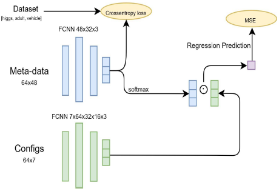

# Performance predictor with learning curves and meta-features

With the recent success of deep learning on a variety of applications, tuning hyperparameters of Deep Neural Networks (DNNs) with least expense has become a practical topic. In fact, every time, to try a new setting a human expert has to inspect the resulting curves to decide if it results in a poor performance or worth keep-on evaluating.

This project addresses these issues and tackles two main tasks:

## Task A: Performance predictor of architecture configurations using Learning Curves:
### Problem:
- Predict the final performance of a configuration given its first 10 epochs curve.
- We dispose of a dataset 2000 configurations from LC Benchmark.
### Approach:
- CNN as a feature extractor to capture the behaviour of the first 10 epochs curves.
- Concatenate the output with the configurations and feed the regressor (MLP).
- Optimizer: Adam with learning rate scheduling using cosine annealing warm
starts.

## Task B: Performance predictor of architecture configurations in unseen datasets using Meta-Features.

### Problem:

- 4 Datasets to train and validate with 2000.
- 4 Datasets to train and validate with 2000 configurations each and meta-features to describe the dataset.
- Training datasets: : Higgs, Vehicle, Adult, Volkert.
- Unseen Test datasets: : Fashion-MNIST, Jasmine.

### Approach:

- Cleaning and metadata augmentation since we have just 4 "data points" to train on by introducing jitter in the metadata.
- Train with 3 datasets and validate on the 4th unseen dataset. we tried all combinations and picked the best.
- Ensemble of regressors weighted by similarity meta-features (filter).
- Learn a representation of the configuration that would be weighted by the filter.

    